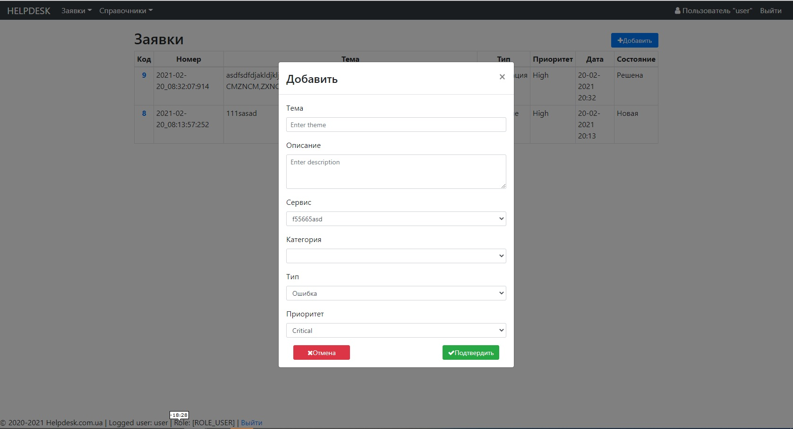
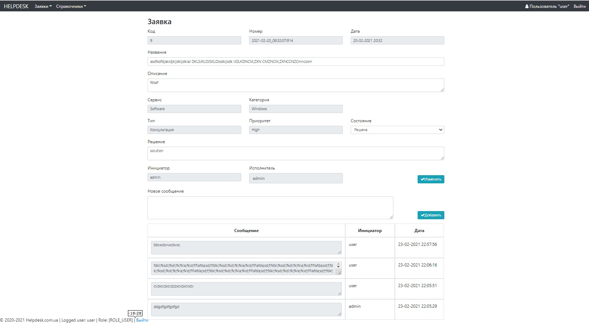

# HelpDesk

Build
status: 

HelpDesk is a simple ticketing system.

**To using necessary**:

- IDE
- JDK 9 or later
- Maven
- PostgreSQL or MySQL database

#### Screenshot with example

### TODO

- Add tables' pagination, quick search;
